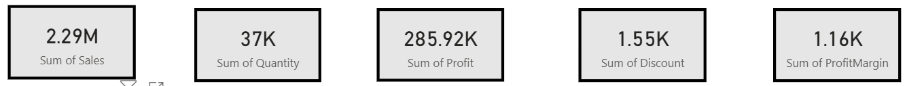

# Sales Performance Dashboard (Sample Superstore)

This project showcases an interactive sales dashboard built in **Power BI**, with **SQL-based data cleaning**. It analyzes sales performance across regions, categories, segments, and cities using the Sample Superstore dataset.

---

## 📊 Dashboard Features

- **KPI Cards**: Total Sales, Profit, Quantity, Discount, Profit Margin
- **Sales by Region**: Bar chart showing regional contribution
- **Profit by Category/Sub-Category**: Tree map for profitability insights
- **Top Cities by Sales**: Table with conditional formatting
- **Sales by Segment**: Donut chart showing Consumer, Corporate, Home Office split
- **Discount vs Profit**: Scatter plot showing impact of discounting
- **Interactive Filters**: Region, State, Segment slicers

---

## 🧹 Data Cleaning (SQL)

SQL scripts used to clean and prepare the dataset before visualization:

### `cleaning.sql`
- Removes duplicate records using `ROW_NUMBER()`
- Handles NULLs in numeric fields
- Standardizes data types
- Trims text fields
- Adds calculated `ProfitMargin` column

### `verification.sql`
- Confirms row count and NULL handling
- Calculates average profit margin
- Verifies duplicate removal
- Previews cleaned data

Scripts are available in the [`sql_scripts/`](sql_scripts/) folder.

---

## 📁 Repository Structure

  sales-performance-dashboard/
  
  ├── README.md 
  
  ├── SalesDashboard.pbix 
  
  ├── Dashboard.pdf 
  
  ├── images/ 
  
  │   ├── kpi_cards.png 
  
  │   ├── sales_by_region.png
  
  │   └── full_dashboard.png 
  
  └── sql_scripts/ 
  
  |   ├── cleaning.sql 
  
  |   └── verification.sql

---

## 📷 Screenshots

  
  

---

## 📌 Insights

- **South region** drives highest sales
- **Technology category** yields strong profits
- **Discounts above 0.4** reduce profitability significantly
- **Consumer segment** contributes ~19% of sales, **Home Office** ~49%

---

## 📌 Business Insights

From the Sales Performance Dashboard, several key insights emerge:

- **Regional Performance**  
  The **South region** contributes the highest sales, indicating strong market presence and potential for expansion.

- **Category Profitability**  
  The **Technology category** yields the highest profit, especially Phones and Accessories, suggesting these are growth drivers.  
  Office Supplies show moderate profit, while Furniture has mixed results, highlighting areas for cost control.

- **Discount Impact**  
  Discounts above **0.4** correlate with negative profits, showing that aggressive discounting strategies reduce margins.  
  Controlled discounting is essential to maintain profitability.

- **Customer Segments**  
  The **Home Office segment** drives nearly half of total sales, making it a critical customer base.  
  The **Consumer segment** contributes ~19%, while **Corporate** adds ~31%, showing balanced distribution.

- **City-Level Insights**  
  Top cities like **Jacksonville and Atlanta** dominate sales, useful for targeted marketing and resource allocation.  
  Smaller cities contribute less, suggesting opportunities for localized campaigns.

---

## 🚀 How to Use

- Clone this repo and open `SalesDashboard.pbix` in Power BI Desktop
- Or view `Dashboard.pdf` for a static preview

---

## 🔮 Future Enhancements

- Add time-based analysis if `Order Date` is available
- Deploy to Power BI Service for live sharing
- Extend SQL logic for trend and cohort analysis

---

## 📬 Connect

Created by [Dipika](https://github.com/Dipika-ds)  
Feel free to fork, star, or reach out for collaboration!
